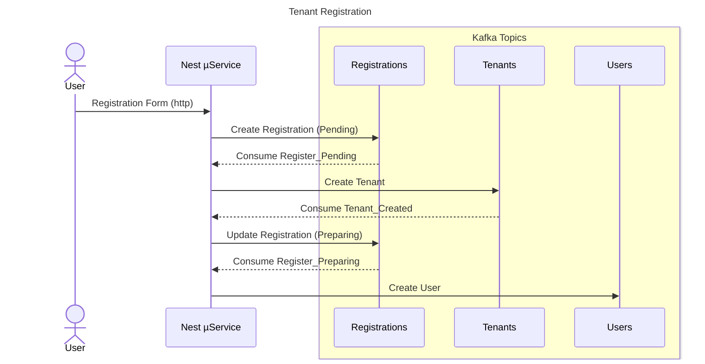

# NestJS + KafkaJS Starter Template

This repository serves as a starter template for building applications using NestJS with KafkaJS modules integrated. It provides an initial setup, making it easier to get started with Kafka in a NestJS application.

## 🚀 Getting Started

### Prerequisites

- Node.js (version as specified in nest.js)
- A Confluent kafka and schema registry configuration (see .env.example)

### Installation

```
npm install

# create and update .env file
cp .env.example .env

# update with necessary config values
```

### Sequence Diagram



